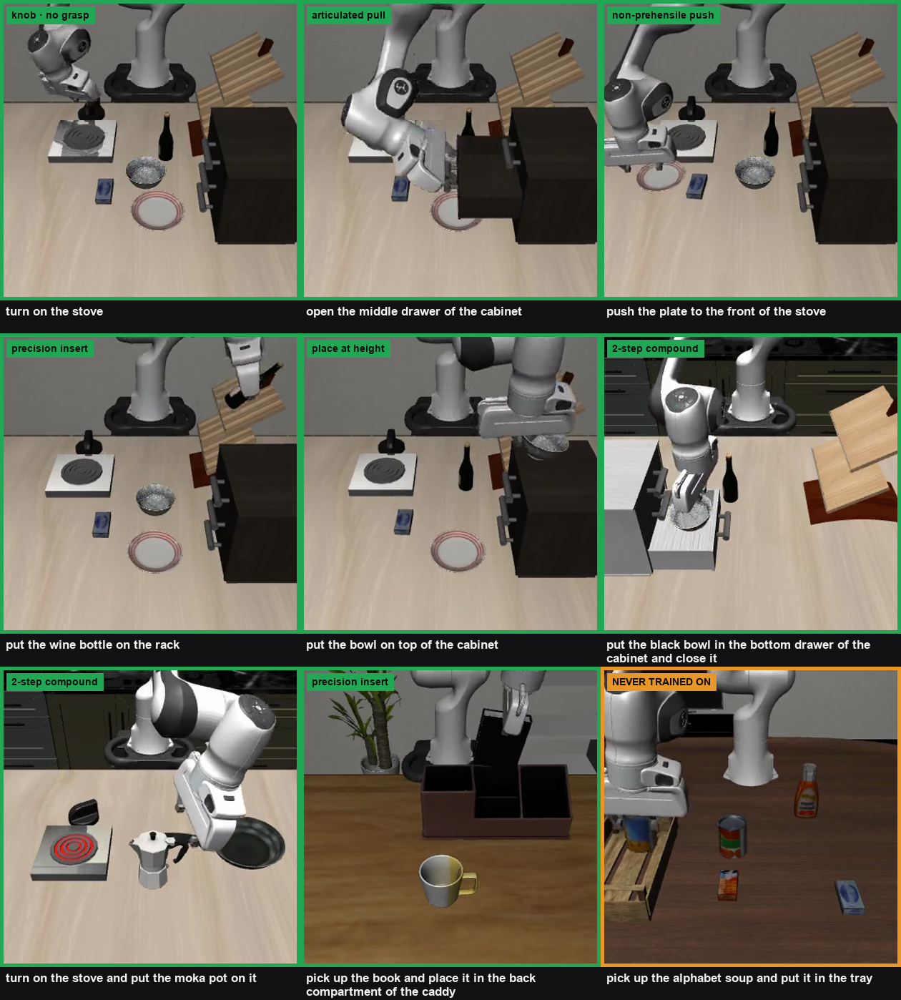

<div align="center">

# vla-lab

**Fine-tuning SmolVLA on LIBERO — natively on a Mac, with an eval harness that can produce a trustworthy zero**

[[Engineering notes]](NOTES.md) · [[Eval harness]](eval_libero.sh) · [[Rollout review]](review_rollouts.py)



</div>

---

A week-one VLA on-ramp built to answer one question: can a single person fine-tune a
vision-language-action policy and get a **success rate you can believe**, without a Linux box?

LIBERO runs natively on Apple Silicon — no CUDA, no `mjpython`. Training runs on a rented GPU,
evaluation runs on the laptop.

## Results

SmolVLA (450 M params, ~100 M trainable, frozen vision encoder), fine-tuned on LIBERO.

| Model | Suite | n | Success |
|---|---|---:|---:|
| `smolvla_base`, no fine-tune | libero_object | 20 | **0.0 %** ← control |
| fine-tuned, final ckpt | libero_goal | 100 | **68.0 %** |
| fine-tuned, ckpt 7500 | libero_object | 100 | **50.0 %** |
| fine-tuned, final ckpt (10000) | libero_object | 100 | 30.0 % |
| fine-tuned, final ckpt | libero_10 | 50 | 36.0 % |
| fine-tuned, final ckpt | libero_90 **unseen** | 32 | **3.1 %** |

**Three findings worth more than the headline number:**

1. **The control matters more than the result.** `pc_success = 0.0` on the un-finetuned base proves
   the harness is not accidentally scoring successes. An eval that cannot produce a trustworthy zero
   is not an eval.
2. **The last checkpoint is not the best checkpoint.** On libero_object, step 7500 scores 50.0 %
   and step 10000 scores 30.0 % — a 20-point gap, invisible if you only evaluate `final`.
3. **Generalization collapses.** 68 % in-distribution against **3.1 % on unseen tasks**. The
   in-distribution number on its own is close to meaningless.

At n=100 the standard error is ~5 points; at n=20 it is ~11. **A 55 % vs 60 % difference between
two checkpoints is noise.** Watch the failure rollouts, not the percentage.

## Quick start

```bash
./setup_mac.sh                 # LIBERO + lerobot on Apple Silicon
N=2 ./eval_libero.sh           # baseline control, ~2.5 min, expect 0.0%
./train_libero.sh              # fine-tune (rented GPU; see setup_cloud.sh)
./eval_all.sh                  # full sweep across suites
python review_rollouts.py      # per-task table + tiled success/failure video
```

Verified on M4 Pro / 48 GB / macOS 26.5.2 — python 3.12.12, lerobot 0.6.1, torch 2.11.0.

## Install traps

Twelve of them are written up in [NOTES.md](NOTES.md), including the two that cost the most time:
`lerobot 0.6.1` requires Python ≥ 3.12 (a 3.11 venv silently resolves to an ancient version), and a
missing `~/.libero/config.yaml` looks exactly like a hang at 0 % CPU.

## License

Apache-2.0.
